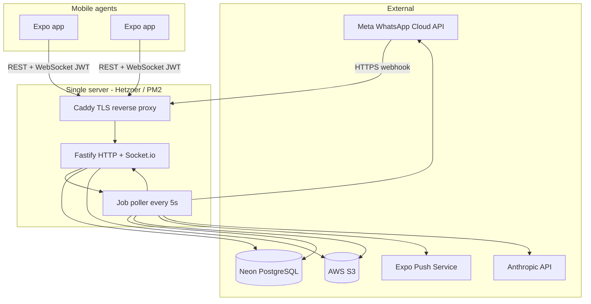
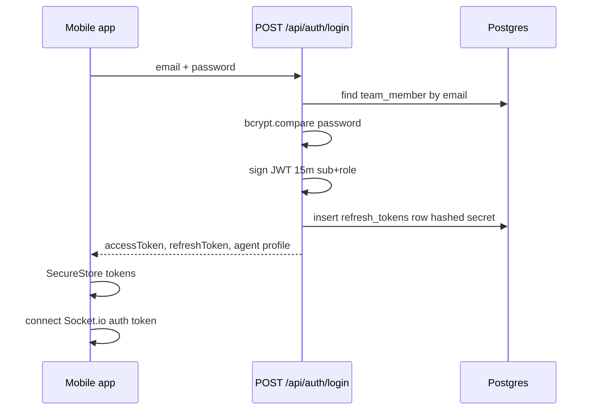
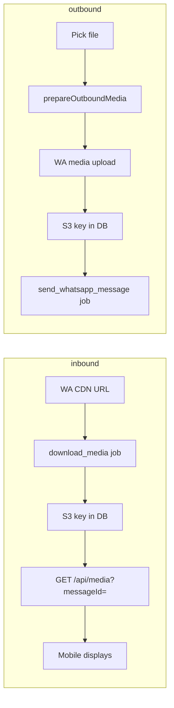

# WhatsApp Business Team Inbox — Full Flow Report (A to Z)

**Purpose of this document:** End-to-end description of how the application works today — architecture, data, security, and every major user and system flow. Use this for technical review, onboarding, and production planning.

**Repository layout:**
- [`backend/`](backend/) — Node.js 20+ API (Fastify, Drizzle, Neon Postgres, Socket.io, S3, in-process job worker)
- [`mobile/`](mobile/) — Expo (React Native) agent app (Expo Router, TanStack Query, Zustand, Socket.io client)
- [`infra/`](infra/) — Caddy, deploy script, Cloudflare tunnel notes for local webhooks

**Product model:** A **shared team sales inbox** connected to one WhatsApp Business phone number. Multiple human agents (and optionally an AI agent) see the same conversations. There is **no per-agent conversation isolation** — any logged-in agent can open any chat (shared inbox).

---

## 1. High-level architecture



**Critical deployment constraint:** Socket.io and the job worker run **in the same Node process** as the API. PM2 is configured for **one instance**. Horizontal scaling would require Redis for Socket.io and an external worker.

---

## 2. Technology stack

| Layer | Technology | Role |
|-------|------------|------|
| API server | Fastify 4 | HTTP routes, plugins, global error handler |
| Auth | `@fastify/jwt` + DB refresh tokens | 15-minute access JWT; 30-day opaque refresh |
| ORM | Drizzle | Type-safe SQL, migrations |
| Database | Neon serverless Postgres | Contacts, conversations, messages, jobs, webhooks |
| Realtime | Socket.io 4 | Inbox/chat updates, typing, presence |
| Media storage | AWS S3 | Keys under `media/` prefix; presigned GET for clients |
| Media processing | Sharp, ffmpeg-static | Resize images, transcode video/audio for WA limits |
| Mobile | Expo SDK 53+, Expo Router | iOS/Android agent UI |
| Mobile state | TanStack Query + Zustand | Server cache + auth session |
| Mobile storage | expo-secure-store | JWT only; query cache on device filesystem |
| Jobs | Postgres `jobs` table | No Redis; `FOR UPDATE SKIP LOCKED` claiming |
| AI (optional) | Anthropic Claude | ~10% of new chats can route to `ai_agent` role |

---

## 3. Data model (what is stored)

### 3.1 Core entities

| Table | Purpose |
|-------|---------|
| `team_members` | Agents (`admin`, `agent`) and system `ai_agent` (no password) |
| `refresh_tokens` | Hashed opaque refresh secrets; rotation + reuse detection |
| `contacts` | One row per WhatsApp user (`wa_id` unique) |
| `conversations` | **One thread per contact** (`contact_id` unique). Status: `open` / `resolved` / `pending`. Assignment, unread, CTWA fields, messaging windows |
| `messages` | Inbound/outbound messages. `wa_message_id` unique for dedup. `media_url` = S3 key, not public URL |
| `jobs` | Async work queue (send message, download media, push, AI reply) |
| `webhook_events` | Raw Meta payloads persisted **before** HTTP 200 ack |
| `conversation_events` | Audit: assigned, resolved, reopened, handoff |
| `webhook_events` | Durable webhook inbox for crash recovery |

### 3.2 Conversation rules

- **One conversation per contact forever** — returning customers reopen the same thread (`status` may flip `resolved` → `open` on new inbound).
- **Shared inbox:** `assigned_to` is for workload/ownership UI, not access control. Any agent can read any conversation via API.
- **Unread:** `conversations.unread_count` incremented on inbound; reset when agent marks read.

### 3.3 Message rules

- **Inbound dedup:** `INSERT … ON CONFLICT DO NOTHING` on `messages.wa_message_id`.
- **Outbound lifecycle:** `status` = `pending` → job sends to Meta → `sent` → webhook statuses → `delivered` / `read` / `failed`.
- **Metadata:** Full raw WhatsApp payload stored in `messages.metadata` (jsonb) for debugging and rich types.

---

## 4. Server startup flow

**Entry:** [`backend/src/index.ts`](backend/src/index.ts)

1. Load and validate environment via Zod ([`backend/src/config.ts`](backend/src/config.ts)). Production refuses: `WEBHOOK_SKIP_SIGNATURE=true`, `CORS_ORIGINS=*`, `JWT_SECRET` &lt; 64 chars.
2. Build Fastify app: Helmet, CORS, multipart (100MB), rate limit (100/min; webhook POST exempt).
3. Register plugins: JWT auth, S3, Socket.io on the HTTP server.
4. Register routes under `/api/*`.
5. Log ffmpeg availability (audio/video transcoding).
6. **Start job processor** (5s poll interval).
7. **Replay unprocessed `webhook_events`** from prior crashes (up to 50).
8. Listen on `0.0.0.0:PORT` (default 3001).
9. SIGTERM/SIGINT: stop worker, close server.

**Health:**
- `GET /health` — DB ping
- `GET /health/ready` — DB + job worker heartbeat &lt; 30s

---

## 5. Authentication and session flow

### 5.1 Login (mobile → backend)



**Files:** [`backend/src/routes/auth.ts`](backend/src/routes/auth.ts), [`mobile/stores/authStore.ts`](mobile/stores/authStore.ts), [`mobile/app/(auth)/login.tsx`](mobile/app/(auth)/login.tsx)

- Refresh token format: `{uuid}.{64-byte-hex-secret}` — only the hash is stored.
- **Rate limit:** 10 login attempts / 15 min per IP + email.
- `ai_agent` rows cannot log in (no `password_hash`).

### 5.2 Token refresh

- Mobile axios interceptor on `401` triggers single-flight `POST /api/auth/refresh`.
- Old refresh revoked; new pair issued. **Reuse detection:** presenting a revoked refresh revokes entire family + sets `token_revoked_at` on the member.
- Socket reconnects with new JWT via `reauthSocket()`.

### 5.3 Cold start (app reopen)

1. `authStore.hydrate()` reads tokens from **expo-secure-store**.
2. If access token exists → `GET /api/auth/me` loads agent profile (name, role).
3. `AuthGate` in [`mobile/app/_layout.tsx`](mobile/app/_layout.tsx) routes to inbox or login.
4. `SocketBridge` connects Socket.io when authenticated.

### 5.4 Protected routes

All `/api/*` except `/api/auth/login`, `/api/auth/refresh`, and `/api/webhook/*` require `Authorization: Bearer <accessJWT>`.

Middleware [`app.authenticate`](backend/src/plugins/auth.ts): verifies JWT + checks `token_revoked_at` on the member.

---

## 6. Inbound message flow (WhatsApp → your database → agents)

This is the most critical path for reliability.

### 6.1 Webhook HTTP handling

**Endpoint:** `POST /api/webhook/whatsapp` — [`backend/src/routes/webhook.ts`](backend/src/routes/webhook.ts)

1. **Raw body required** — JSON parser replaced with buffer parser so `x-hub-signature-256` matches Meta’s bytes.
2. **HMAC verify** — `sha256=` + `timingSafeEqual` against `WHATSAPP_APP_SECRET`. Dev can use `WEBHOOK_SKIP_SIGNATURE` (blocked in production).
3. **Persist first** — insert full JSON into `webhook_events` ([`webhook-inbox.ts`](backend/src/services/webhook-inbox.ts)).
4. **Respond 200 immediately** — Meta must not wait for processing.
5. **`setImmediate`** — process event by id asynchronously.

**GET verification:** `hub.mode=subscribe` + verify token (constant-time compare) → return `hub.challenge`.

### 6.2 Webhook processing

**Processor:** [`backend/src/services/webhook-processor.ts`](backend/src/services/webhook-processor.ts)

For each Meta `entry.changes[]`:

| Payload field | Handler | Action |
|---------------|---------|--------|
| `messages[]` | `handleMessages` | Customer inbound |
| `message_echoes[]` | `handleMessageEchoes` | Copies of messages sent from WA Business app / coexistence |
| `statuses[]` | `handleStatuses` | sent / delivered / read / failed on outbound |

**Per inbound message:**

1. Upsert `contacts` by `wa_id`; update display name if provided.
2. Upsert `conversations` by `contact_id` (create if new).
3. Insert `messages` (dedup on `wa_message_id`).
4. Update conversation: `window_expires_at` (+24h CSW), preview fields, `unread_count++`, CTWA/referral fields if ad click.
5. If conversation was `resolved` → set `open` + `conversation_events` type `reopened`.
6. **Socket:** `emitNewMessage` + `inbox_updated` (broadcast to all agents).
7. If media type → enqueue `download_media` job.
8. If unassigned → [`routeConversation`](backend/src/services/router.ts) (AI bucket or least-loaded online human).

**On duplicate webhook (Meta retry):** row skipped; still refreshes `window_expires_at`.

### 6.3 Inbound media job

**Job type:** `download_media` — [`backend/src/services/media-processor.ts`](backend/src/services/media-processor.ts)

1. Download from WhatsApp CDN URL (Bearer token, DNS fallback).
2. Upload to S3 under `media/{conversationId}/{messageId}/…`.
3. Update `messages.media_url` (key), `media_status = uploaded`.
4. Socket: `media_ready` or `media_failed` after retries exhausted.

### 6.4 Status updates (ticks)

Webhook `statuses` → update `messages.status` with monotonic rules ([`message-status.ts`](backend/src/utils/message-status.ts)) → `emitMessageStatus` to all clients.

### 6.5 Mobile reaction to inbound

[`mobile/hooks/useSocket.ts`](mobile/hooks/useSocket.ts) patches TanStack Query cache:

- Append message to `['messages', conversationId]` infinite query pages.
- Reorder inbox list, bump unread, update last preview.
- On `media_ready` → invalidate presign cache, sync file to local disk cache.

**No full refetch required** for happy path — reduces flicker.

---

## 7. Outbound message flow (agent → WhatsApp → customer)

### 7.1 API entry

**Endpoint:** `POST /api/conversations/:id/messages` — [`backend/src/routes/conversations.ts`](backend/src/routes/conversations.ts)

**Pre-checks:**
- JWT auth.
- Conversation exists with contact.
- **Messaging window:** [`resolveMessagingState`](backend/src/utils/messaging-windows.ts) — `canSendSession` must be true (24h customer service window open). Otherwise `WINDOW_EXPIRED` unless using template endpoint.

**Rate limit:** 10 messages / minute / agent.

**Content types:**
| Type | Transport | Processing |
|------|-----------|------------|
| Text | JSON `{ type: 'text', body }` | Immediate DB row + job |
| Audio | JSON base64 | Transcode to OGG Opus, upload WA + S3 |
| Image/video/doc/sticker | multipart `file` | `prepareOutboundMedia` → WA upload → S3 |
| Location | JSON lat/lng | Job sends location message |
| Media reuse | JSON `reuseS3Key` | Skip re-upload if same content hash |

### 7.2 Persistence + job queue

**Service:** [`backend/src/services/outbound.ts`](backend/src/services/outbound.ts)

1. Insert `messages` row (`direction=outbound`, `status=pending`, `sent_by=agentId`).
2. Enqueue `send_whatsapp_message` job with payload (to, type, body/mediaId, reply refs).
3. Update conversation preview + emit `new_message` to sockets (optimistic UI on mobile matches this).

### 7.3 Job execution

**Worker:** [`backend/src/workers/job-processor.ts`](backend/src/workers/job-processor.ts) → `handleSendMessage`

1. **Idempotency:** if `wa_message_id` already set → skip (prevents duplicate sends on retry).
2. Call [`whatsapp.ts`](backend/src/services/whatsapp.ts) Graph API (`WHATSAPP_API_VERSION` pinned in env).
3. Retry 429/5xx with backoff.
4. Update row: `wa_message_id`, `status=sent`.
5. Emit `message_status` to sockets.

**Failure:** after max attempts → `status=failed`, `error_message` set, socket notifies UI.

### 7.4 Template messages (outside 24h window)

**Endpoint:** `POST /api/conversations/:id/messages/template`

- Does **not** require open CSW.
- Uses `createOutboundTemplate` → same job queue with `type: 'template'`.
- Body stored as `[template: name]` in DB.

**Mobile:** Template sheet when `needsTemplateForReply` — [`MessagingWindowTimer`](mobile/components/MessagingWindowTimer.tsx), [`mobile/lib/messagingWindow.ts`](mobile/lib/messagingWindow.ts).

### 7.5 Mobile send UX

[`mobile/app/conversation/[id].tsx`](mobile/app/conversation/[id].tsx):

- Optimistic bubbles via TanStack `onMutate` in [`useConversations.ts`](mobile/hooks/useConversations.ts).
- Text offline queue: [`mobile/lib/offlineQueue.ts`](mobile/lib/offlineQueue.ts) flushes on reconnect (text only).
- Voice recording → JSON audio upload.
- Attach menu: camera, gallery, document, location.

---

## 8. Messaging windows (Meta business rules)

| Window | Duration | Stored in | Effect on send |
|--------|----------|-----------|----------------|
| **CSW** (customer service) | 24h from last **customer** message | `window_expires_at` | `canSendSession` = true → free-form session messages allowed |
| **CTWA FEP** (free entry point) | 72h from qualifying business reply | `fep_expires_at` | Tracked for UI; **session send still requires CSW open** in current code |
| **CTWA reply deadline** | 24h from ad click start | `ctwa_started_at` | UI nudge to reply and open FEP |

**Mobile UI:** Header chip + banner ([`MessagingWindowTimer`](mobile/components/MessagingWindowTimer.tsx)) shows countdown; composer switches to template button when session closed.

---

## 9. Read receipts and inbox read state

### 9.1 Agent opens chat

1. Mobile `POST /api/messages/:conversationId/read` on focus.
2. Backend marks conversation `unread_count = 0`.
3. Finds latest inbound message with `wa_message_id` → calls WhatsApp `markAsRead` (fire-and-forget).
4. Socket / cache: inbox unread badge clears.

### 9.2 Manual unread

`POST /api/messages/:conversationId/unread` — sets unread count for inbox swipe gesture (like WhatsApp).

---

## 10. Real-time layer (Socket.io)

### 10.1 Connection

- URL: same host as API (`EXPO_PUBLIC_SOCKET_URL`).
- Auth: `{ token: accessJWT }` in handshake.
- Same revocation check as REST.

### 10.2 Rooms

| Room | Joined when | Used for |
|------|-------------|----------|
| `agent:{id}` | On connect | Per-agent targeting (future) |
| `conversation:{id}` | Client emits `join_conversation` | Typing indicators (optional) |

Most events are **broadcast globally** (`io.emit`) so inbox updates work without joining rooms.

### 10.3 Server → client events

| Event | When |
|-------|------|
| `new_message` | Inbound/outbound message committed |
| `message_status` | Delivery/read/failed ticks |
| `message_updated` / `message_deleted` | Edits (if used) |
| `media_ready` / `media_failed` | S3 pipeline done |
| `inbox_updated` | List should refresh metadata |
| `conversation_updated` / `conversation_assigned` | Status/assignment |
| `agent_online` / `agent_offline` | Presence |
| `typing_indicator` | Another agent typing in chat |

### 10.4 Client → server events

| Event | When |
|-------|------|
| `join_conversation` / `leave_conversation` | Chat screen mount/unmount |
| `typing_start` / `typing_stop` | Composer draft changes |
| `presence_ping` | Optional heartbeat |

### 10.5 Mobile resilience

- Reconnect: invalidate `conversations`, `team`, all `messages` queries.
- Banner when disconnected: [`SocketConnectionBanner`](mobile/components/SocketConnectionBanner.tsx).

---

## 11. Media end-to-end flow



**Presign security:** [`GET /api/media/*`](backend/src/routes/media.ts) requires `?messageId=` matching `messages.media_url` for that id.

**Local cache:** [`mobile/lib/messageMediaCache.ts`](mobile/lib/messageMediaCache.ts) stores files on device for fast replay; content-hash dedup for outbound uploads.

---

## 12. Inbox and conversation management flows

### 12.1 Inbox list

**Screen:** [`mobile/app/(tabs)/inbox.tsx`](mobile/app/(tabs)/inbox.tsx)

- `GET /api/conversations` with cursor pagination (`lastMessageAt`).
- Filters: All / Open / Resolved / Mine (`assignedTo=me`).
- Search: server-side `search` param (debounced 300ms on mobile).
- Pull-to-refresh, infinite scroll, skeleton loading.
- Swipe: pin, mark read/unread.

### 12.2 Chat screen

**Screen:** [`mobile/app/conversation/[id].tsx`](mobile/app/conversation/[id].tsx)

- Messages: `GET /api/conversations/:id/messages` with `before` cursor (infinite scroll upward).
- Overflow menu: resolve / reopen, assign, attribution.
- Reply swipe, forward, long-press actions.
- In-chat search: `?q=` on messages API.
- Scroll scrubber, scroll-to-latest FAB.

### 12.3 Assignment and resolve

- `PATCH /api/conversations/:id` — `{ status, assignedTo, notes }`.
- Events logged in `conversation_events`.
- Push job enqueued for assignee on new assignment ([`router.ts`](backend/src/services/router.ts)).

### 12.4 Team tab

**Screen:** [`mobile/app/(tabs)/team.tsx`](mobile/app/(tabs)/team.tsx) — online presence via socket + `GET /api/team`.

---

## 13. Conversation routing and AI agent (optional)

**On first unassigned inbound** ([`router.ts`](backend/src/services/router.ts)):

1. **~10% deterministic bucket** (`AI_ROUTING_FRACTION`) → assign to `ai_agent` member → enqueue `ai_agent_reply` job.
2. Else → assign to online human with fewest open conversations.
3. If nobody online → leave unassigned (still visible in All).

**AI job** ([`ai-agent.ts`](backend/src/services/ai-agent.ts)): calls Anthropic, sends reply via WhatsApp, can emit `ESCALATE:` to hand off to humans (`routing_lock = human_only`).

**Production note:** If `ANTHROPIC_API_KEY` is invalid, set `AI_ROUTING_FRACTION=0` or AI-assigned chats will not get replies.

---

## 14. Push notifications (mobile background)

1. On login / session: [`registerForPushNotifications`](mobile/lib/push.ts) → Expo token → `PATCH /api/team/me`.
2. Backend job `send_push_notification` → Expo Push API.
3. **Requires EAS development/production build** — not available in Expo Go (SDK 53+).
4. Tap handler: [`PushNotificationBridge`](mobile/components/PushNotificationBridge.tsx) navigates to `conversation/{id}`.

**Gap:** Inbound messages do not automatically enqueue push to all agents today — push is used heavily on **assignment**. Extend if you need notify-on-every-message.

---

## 15. Job queue (complete reference)

| Job type | Trigger | Worker action |
|----------|---------|---------------|
| `send_whatsapp_message` | Outbound text/media/location/template | Graph API send |
| `download_media` | Inbound media webhook | WA download → S3 |
| `send_push_notification` | Assignment, etc. | Expo Push |
| `ai_agent_reply` | AI-routed conversation | LLM + send |

**Claiming:** `FOR UPDATE SKIP LOCKED`, stale lock recovery after 2 min, backoff 1m / 5m / 30m, max 3 attempts default.

---

## 16. Mobile app navigation map

```
app/
  index.tsx              → redirect
  (auth)/login.tsx       → login
  (tabs)/
    inbox.tsx            → conversation list
    team.tsx             → team presence
  conversation/[id].tsx  → chat thread
  settings.tsx           → settings
```

**Global bridges** (in `_layout.tsx` when authenticated):
- `SocketBridge` — socket lifecycle
- `OfflineSyncBridge` — NetInfo + text queue flush
- `MediaCacheBridge` — prefetch media
- `PushNotificationBridge` — push registration + deep link
- `GlobalAudioHost` — exclusive audio playback

---

## 17. Security model (summary)

| Surface | Mechanism |
|---------|-----------|
| Webhook | HMAC-SHA256 on raw body; durable store before ack |
| REST | JWT + revocation timestamp |
| Login | bcrypt cost 12; rate limited |
| Refresh | Rotation + reuse detection |
| Media | Presign only with valid `messageId` + key match |
| Socket | Same JWT as REST |
| CORS | Explicit origins in production |
| Mobile tokens | SecureStore only |
| Production transport | Mobile release builds require HTTPS URLs |

**Not implemented:** Certificate pinning; per-agent conversation ACL (by design: shared inbox).

---

## 18. Failure modes and recovery

| Failure | System behavior |
|---------|-----------------|
| Crash after webhook 200 | Row in `webhook_events` without `processed_at` → replay on startup |
| Meta webhook retry | Dedup on `wa_message_id` |
| WA send succeeds, DB fails | Job retry skips if `wa_message_id` already set (idempotent) |
| WA send fails | Backoff; permanent fail → message `failed` |
| Media download fails | Job retries; `media_failed` socket event |
| Socket disconnect | Mobile shows banner; refetch on reconnect |
| Offline agent | Text queued locally; flush on online |
| Worker stall | `/health/ready` returns 503 if no poll in 30s |

---

## 19. External configuration checklist

| Variable | Purpose |
|----------|---------|
| `DATABASE_URL` | Neon pooled connection |
| `DATABASE_URL_UNPOOLED` | Migrations |
| `JWT_SECRET` | Access token signing (64+ in prod) |
| `CORS_ORIGINS` | Allowed browser/app origins |
| `WHATSAPP_*` | Cloud API credentials |
| `WHATSAPP_API_VERSION` | Pinned Graph version (e.g. v25.0) |
| `AWS_*` / `S3_BUCKET_NAME` | Media storage |
| `S3_ENSURE_LIFECYCLE` | Optional 30-day lifecycle on `media/` |
| `ANTHROPIC_API_KEY` | AI agent |
| `AI_ROUTING_FRACTION` | 0.0–1.0 AI routing share |
| `EXPO_PUBLIC_API_URL` | Mobile REST base |
| `EXPO_PUBLIC_SOCKET_URL` | Mobile WebSocket base |

---

## 20. API quick reference

See full table in [`backend/README.md`](backend/README.md). Unauthenticated: webhook, login, refresh. Everything else: Bearer JWT.

---

## 21. Production readiness snapshot (for reviewers)

**Working well in dev (per live logs):** conversations, messages, read receipts, templates, media presign, WhatsApp send/receive, team list, cursor pagination.

**Before production:**
1. Run migrations (`webhook_events`).
2. Fix production `.env` (JWT length, CORS, webhook signature, `AI_ROUTING_FRACTION`).
3. HTTPS + domain (Caddy).
4. EAS build + push credentials.
5. Meta webhook on production URL with real signature verification.
6. Rotate any secrets that lived in dev `.env`.

**Compared to official WhatsApp Business app:** Core chat, media, templates, windows, team inbox, and real-time are implemented. Gaps for parity: reliable background push on every message, multi-device polish, catalog/commerce flows, and some message types (polls, reactions as first-class UI).

---

*Document generated from codebase state. For change history of hardening work, see [`PRODUCTION_REVIEW_REPORT.md`](PRODUCTION_REVIEW_REPORT.md).*
