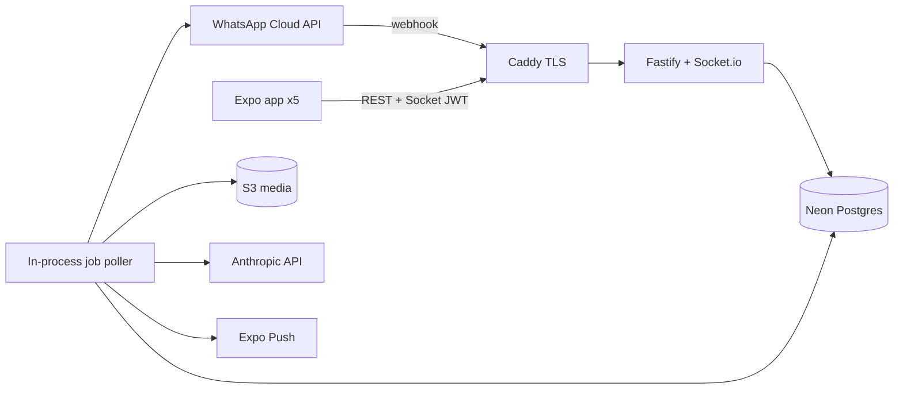

# WhatsApp Business Team Sales Inbox

A production-oriented WhatsApp Business team sales inbox: a Node.js + Fastify API
and an Expo (React Native) mobile app. Built for a 5-agent team handling
Click-to-WhatsApp (CTWA) conversations (~1k/day), with ~10% routed to an
LLM-powered AI agent and the rest to humans.

```
/
├── backend/   Fastify + Drizzle + Neon + Socket.io + S3 + Anthropic + DB job queue
└── mobile/    Expo Router + TanStack Query + Zustand + NativeWind + Socket.io client
```

See [`backend/README.md`](backend/README.md) and [`mobile/README.md`](mobile/README.md)
for per-app setup.

## Architecture



## Quick start (local)

1. Backend
   ```bash
   cd backend && npm install && cp .env.example .env
   # fill .env, then:
   npm run db:migrate && npm run seed && npm run dev
   ```
2. Mobile
   ```bash
   cd mobile && npm install && cp .env.example .env
   # set EXPO_PUBLIC_API_URL / EXPO_PUBLIC_SOCKET_URL to your LAN IP
   npx expo start
   ```
3. Log in with `agent1@example.com` / `password123`.

## Highlights / design decisions

- **Auth:** 15-min access JWT (`@fastify/jwt`) + 30-day opaque refresh tokens
  (bcrypt-hashed, rotated on use, with reuse detection). Instant revocation via
  `team_members.token_revoked_at`, enforced on both REST and Socket.io.
- **Webhook integrity:** HMAC over the raw body, immediate `200`, async
  processing, idempotent on `wa_message_id`. Subscribe to **message_echoes**
  in Meta so sends from the WhatsApp app sync into the inbox.
- **Inbox read/unread:** swipe a chat right in the mobile app to mark read or
  unread (like WhatsApp).
- **CTWA attribution:** first-touch only; correct Meta field mapping
  (`source_id` → ad id, `headline` → title, `body` → body) + rich
  `referral_metadata`.
- **Conversation model:** one thread per contact (`UNIQUE(contact_id)`), reopened
  on return.
- **Job queue:** DB-backed, `FOR UPDATE SKIP LOCKED` claiming, exponential
  backoff, single-hop media pipeline (no base64 in the DB).
- **Routing:** deterministic ~10% AI bucketing; AI escalation (`ESCALATE:`) locks
  the thread to humans and re-routes.
- **Single instance** deployment (PM2 `instances: 1`) to match the in-process
  Socket.io server + job poller.

## Local webhooks (Meta + Cloudflare Tunnel)

Expose local port **3001** over HTTPS and set Meta’s callback to
`https://<host>/api/webhook/whatsapp`. See [`infra/cloudflared/README.md`](infra/cloudflared/README.md).

## Deployment

- Server: Hetzner CX21 + Caddy (auto TLS) + PM2.
  ```
  # Caddyfile
  your-domain.com {
    reverse_proxy localhost:3001
  }
  ```
  ```bash
  cd backend && npm run build && pm2 start dist/index.js --name inbox-api -i 1
  ```
- Mobile: `eas build --platform all --profile production` then `eas submit`.

## Post-launch hardening checklist (deferred from v1)

- Lock down CORS / Socket.io origins to an allowlist (v1 uses `*`).
- Move S3 lifecycle rule to Terraform/console (v1 sets it idempotently on startup).
- Add Sentry (API + mobile) and a failed-jobs dashboard.
- Optional presence heartbeat and "viewing" collision UI.
